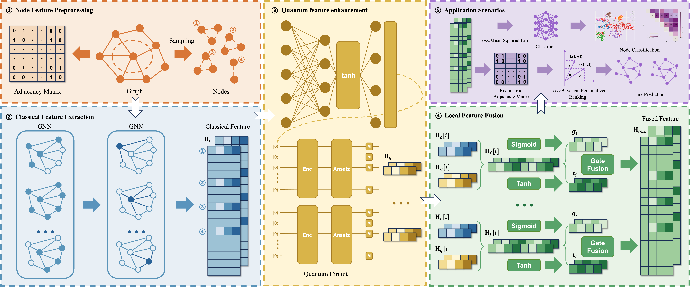

# QGRNN: Feature Fusion-Based Hybrid Quantum-Classical Graph Residual Neural Network

This repository provides the reference implementation of QGRNN, a hybrid quantum–classical graph residual neural network developed to enhance node representation learning.

QGRNN integrates four key components:

- A structure-driven node selection mechanism,
- A GAT-based classical feature extractor,
- A parametrized quantum circuit (PQC) module for targeted nonlinear enhancement,
- A gated residual fusion mechanism that adaptively combines classical and quantum embeddings.

This implementation presents the complete design of QGRNN and illustrates its workflow on a node classification task, using the Cora dataset as a representative example.
